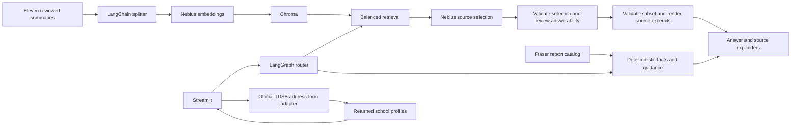

# Toronto School Compass — Week 2 project report

## Project overview and primer

My RAG app helps Toronto parents answer curriculum, school-program and optional childcare questions from eleven curated summaries of official TDSB, Ontario and City of Toronto pages in a Streamlit app, targeting 95% factual-claim faithfulness and 90% of answers under 10 seconds.

This is a custom use case on Track 2: Python, LangChain text splitting and LangGraph orchestration. Alongside RAG, deterministic features provide registration guidance, live regular-program address lookup through TDSB, and Fraser ratings. These features complement retrieval; they are not model-generated school assignment or rating predictions.

Status: local implementation and current evaluation artifacts are ready for review. The targets above are not measured achievement claims. Independent claim-level scoring, the required Google Doc, video, GitHub publication and final submission remain pending; see [assignment audit](SUBMISSION_CHECKLIST.md).

## RAG framework

| Field | Implementation and decision |
| --- | --- |
| Use case | Toronto parents explore school curriculum, programs, registration and Fraser ratings in a web app. Optional childcare questions retain dated, source-backed guidance. |
| Corpus | Eleven English curated summaries cover official school profiles, curriculum, registration and childcare sources, with two reviewed detailed school records. The originating board, province, city and provider remain the source of truth; the summaries are not full original documents. |
| Ingestion and cleaning | A maintainer reviews source text and writes plain-text JSON with source URL, school ID and check date; LangChain splits these records before embedding. A separate fixed-layout PDF importer extracts Fraser rating rows into structured JSON, outside the vector index. |
| Ingestion and freshness | Review the source corpus before demos and after known changes, then run `ingest.py`; freshness is manual, with no automated SLA. The rating importer supports the 2025 report layout and requires revalidation for a new edition; TDSB address results are fetched on demand. |
| Chunking and embedding | Recursive character splitting uses 1,800 characters and 200-character overlap with configured Nebius `Qwen/Qwen3-Embedding-8B`. This preserves short summaries while limiting split context; it is a baseline choice, not an experimentally proven optimum. |
| Retrieve | Chroma dense retrieval returns up to three chunks per selected school plus three board chunks, with curriculum and childcare topic filtering. Explicit school selection and balanced retrieval help comparisons; hybrid search and reranking are not implemented. |
| Generation | Nebius `Qwen/Qwen3-30B-A3B-Instruct-2507`, temperature 0, selects up to four source IDs in a strict JSON response. A separate answerability call reviews nonempty selections against the specific question, then the app validates the returned subset and renders original excerpts with attribution and dates. |
| Fallback | Registration, ratings, boundary, legacy fee and vacancy questions use deterministic handling. Missing evidence/index, empty selections and malformed or out-of-range selections produce fallback messages. Incorrect source selection or inaccurate source content remain possible. |
| Evaluation | Fifteen current-scope questions cover curriculum, comparison, registration years, Fraser scores, ambiguous assignment, optional childcare, injection and unsupported facts. Saved answers, evidence, routes and latency support reproducible review; claim support requires separate adjudication. |

## Architecture

The address form sends the address to the official TDSB service, not to the language model, and retains results in the active session. Public returned school profiles may be supplied as evidence. Chat uses heuristic address routing, not a comprehensive personal-data detector; users are asked to keep home addresses out of chat.

## Datasets and source boundaries

- `data/corpus.json`: eleven curated summaries with source URLs and review dates, indexed as eleven chunks in the current setup.
- `data/schools.json`: two reviewed detailed profiles, Joyce Public School and Glen Park Public School, with optional childcare facts; loaded through an in-memory SQLite directory.
- `data/school_guidance.json`: shared curriculum and registration guidance; application windows are tied to specified entry years, not assumed valid for all years.
- `data/fraser_catalog.json`: 3,052 elementary and 747 secondary Ontario report rows from the 2025 editions, assessment year 2023–24. One published row lacks a current score and remains null.
- `data/fraser_ratings.json`: seven reviewed TDSB school-code overrides. Other ratings require a unique normalized name, exact municipality and known school-level match; ambiguous or absent matches remain unavailable.
- Live TDSB response: current regular-program finder results beyond the two detailed profiles. The official form has no school-year selector, so the selected admission year is not verified.
- `data/submission_evaluation_cases.json`: fifteen current-scope test questions. Earlier childcare and school question sets are preserved as historical experiments.

Ratings are Fraser-only third-party academic indicators, not official TDSB quality ratings or complete assessments of a school. Ontario-wide report row counts do not mean that every TDSB school has a score. See [rating provenance and import instructions](FRASER_RATINGS.md) and [address lookup scope](ADDRESS_MATCHING.md).

## Prompts and AI coding assistance

The complete model instructions are in `provider.py`, in `generate()` and `verify_selection()`. They request only a JSON object containing `source_ids`: up to four distinct source numbers that directly answer the question, or an empty list for insufficient evidence. They prohibit extra prose and instruction-following from retrieved text. The first call selects evidence; the second checks whether it addresses the specific requested detail rather than sharing only a topic. Invalid reviewer output, source IDs outside the supplied selection, or reviewer request failure produce a fallback; the application composes the final cited answer from accepted original excerpts.

The user payload contains the question, selected grade/year when present, and numbered evidence with titles and check dates. `graph.grounded_excerpts()` rejects malformed selections and extra fields. Whole excerpts preserve school-specific context, dates and caveats. This is extractive answer generation rather than conversational paraphrasing; selection relevance and source accuracy are still limitations.

AI coding assistance helped implement the app, investigate failed answers, add the extraction constraint, test it and draft documentation. Independent human validation remains pending.

## Iterations and learnings

1. The initial childcare prototype used four summaries and deterministic fallbacks for missing prices, vacancies and assignment. Its revised 15-question run had 92.65% supported claim units in provisional AI-assisted review, below the 95% target; these historical metrics do not describe the current app.
2. The school-focused iteration expanded to eleven summaries and added grade/year registration guidance. Curriculum retrieval was filtered to learning and school-profile sources after childcare evidence contaminated a program comparison.
3. Live address lookup replaced a prototype-only verification message. Address normalization handles listing formats while failing closed on ambiguity; all returned schools can appear in Explore, even when their detailed programs have not been reviewed.
4. Fraser-only display first used seven reviewed ratings, then a reproducible full-report import. Explicit municipality and level matching prevents assigning a score solely because school names resemble one another.
5. Grounding repair replaced free-form model answers with validated selection and attributed source excerpts after prompt-only restrictions failed. See [grounding validation](evaluation/GROUNDING_FINDINGS.md).
6. Relevance filtering reduced irrelevant retrieval from 33 to 21 excerpts while retaining 13 relevant excerpts in the main regression set. An additional daily-coding question still selected general guidance; the separate answerability review then made that case abstain in the latest run.
7. Submission preparation replaced stale baseline descriptions, created a current 15-question evaluation set and preserved new outputs separately from historical runs.

The main learning is that retrieval scope and structured facts matter as much as prompting. Small curated sources can support a useful demo, but a model can still add plausible details absent from them, and historical quality scores cannot be carried forward after changing the corpus or application.

## Validation and remaining limitations

All 55 automated tests passed on September 12, 2026. They cover address parsing and failure handling, profile selection, grade/year guidance, deterministic ratings and conservative automatic matching, UI rendering, evaluator calculations and a mocked-model integration with real Chroma/LangGraph. They do not establish live model quality or universal boundary accuracy.

The latest sequential live runs covered 15 main questions and five additional phrasings: correct routing, zero request errors and all responses under ten seconds. Four main RAG questions retained supported excerpts and three returned fallbacks; the additional coding-lessons question abstained while broad learning remained answerable. See [latest answerability findings](evaluation/ANSWERABILITY_FINDINGS.md) and the [evaluation overview](EVALUATION.md) for raw artifacts, historical comparisons and limitations.

The latency target was met in these runs, not established as a service guarantee. Independent claim-level faithfulness and citation-support percentages remain unmeasured; the 95% target is not claimed achieved. Comparisons may be incomplete, and the second model call adds cost and latency. No fresh source or live-address verification was performed during this documentation consolidation.

Remaining limitations include a small manually maintained RAG corpus, incomplete school-specific programs, conservative rating coverage, no selected-year guarantee in address lookup, heuristic routing, model-dependent source relevance, and pending independent claim-level review. No chunking comparison or reranking improvement is claimed. The handout permits this custom scope; submission artifacts must still be completed using the [assignment checklist](SUBMISSION_CHECKLIST.md).
