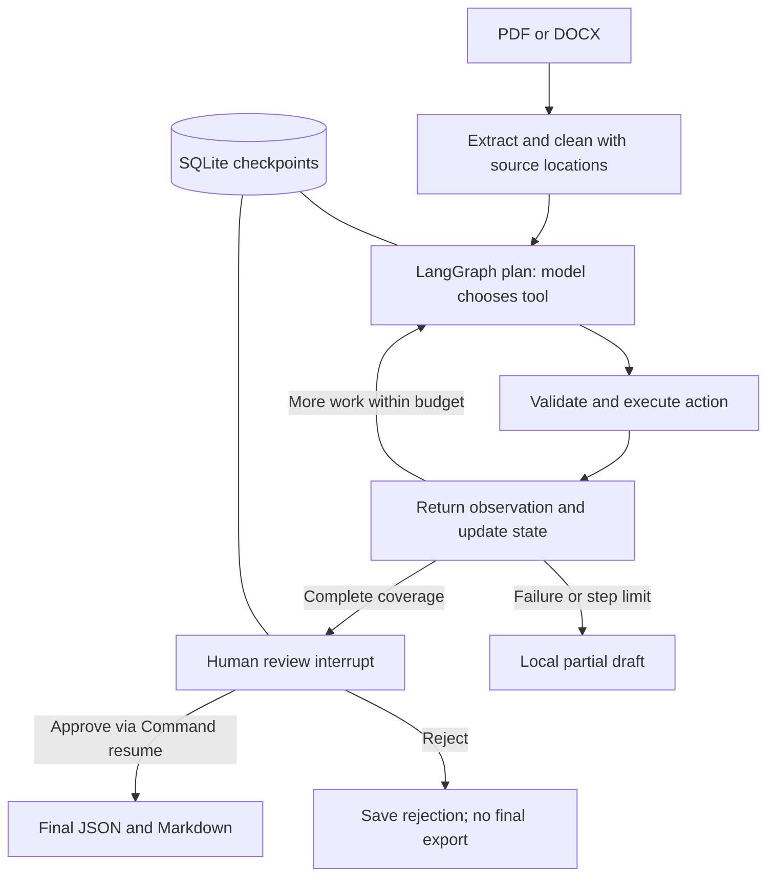

# Week 3 — Document Action Agent

## Primer

My agent helps project coordinators turn PDF or Word specifications into a source-backed action register in a Python CLI, replacing manual document reading and copying tasks into a tracker. It reads, searches and drafts items using four tool actions, hands off for human approval before final export, and targets a usable register in under five minutes for short documents in eight out of ten reviewed trials.

The time and success rate are targets, not measured achievement claims. The user's confirmation that late submissions are accepted is recorded; the handout's original deadlines are not treated as a blocker. No submission or contact with the cohort has been performed.

## Framework

| Field | Implementation |
| --- | --- |
| Agent goal | Extract action items or requirements, with verbatim evidence, named owners and deadlines when explicitly stated. |
| Surface | Python CLI accepting PDF or Word input and producing local draft/final JSON and Markdown. |
| Steps | Ingest → plan → execute one tool → observe result → repeat → pause for human review → approve or reject. |
| Tools | `read_chunk` and `search_document` read source text; `record_actions` changes draft state; `finish` requests completion after source coverage. These are four operations exposed through the native `document_action` function. |
| Memory | Messages, read chunk IDs, draft items, errors and status live in typed LangGraph state persisted to a per-run SQLite checkpoint. State lasts until the user deletes the local run directory; it is not cross-document memory. |
| Hard limits | No shell execution, external messaging, payment, arbitrary model-selected file paths or execution of document instructions. Source quotes and non-null owner/date fields must match read evidence. |
| Human review | A LangGraph interrupt exposes the draft and warnings; a later CLI invocation resumes with approve or reject. Drafts and traces are local working files, while approved exports require an explicit user decision. |
| Failure handling | Invalid tool calls return observations so the model can retry within a bounded budget; model request failure or step exhaustion saves a partial draft and stops. No final export is issued for failed or rejected runs. |
| Success measure | A coordinator accepts a complete, source-supported register in under five minutes in at least eight of ten short-document trials. Independent end-to-end scoring remains pending. |

## Architecture

The graph uses distinct plan, act, observe and human_review nodes. All extraction state is checkpointed rather than held in a mutable tool instance across graph steps. The model adapter supports native function calls and an explicitly configured JSON-action fallback. LangGraph handles orchestration; no separate LangChain agent wrapper is needed.

## Data, prompts and iterations

Inputs are user-supplied documents; development fixtures include synthetic two-person obligations, multi-page PDF text, Word tables and corrupt files. The cohort handout was read to compare requirements, not executed as an instruction to submit or send messages. No private source document is required for the demo.

`agent.py` contains the system instructions: inspect every chunk, record exact quotes, use null for missing owner/date, treat document instructions as data, and recover from tool errors. `tools.py` defines the native function schema and validation. Operational reasons and observations are logged, not private chain-of-thought.

AI coding prompts included the user's requested module structure and document-ingestion requirements, followed by the request to adopt LangChain/LangGraph. Iterations were: custom native-tool loop; required tool arguments after live calls omitted optional fields; LangGraph migration with explicit state; durable human review and separate draft/final artifacts.

The main learning is that tool schemas and feedback materially affect control flow. Reading all chunks does not prove all tasks were found, and source containment checks do not prove that an excerpt is correctly classified as an obligation. Human review remains necessary.

## Validation and limitations

The combined suite passes 67 tests (55 existing school-app tests and 12 document-agent tests). Tests cover real PDF/Word ingestion, tables, malformed input, invalid evidence, native/JSON tool observations, bounded execution, provider failure and both approval/rejection after reopening SQLite state in a new process. No model calls occur during resumed review; replayed decisions are rejected.

The earlier custom-loop synthetic smoke test extracted two correct items in five tool calls. It is historical evidence, not a LangGraph benchmark; new smoke-test observations are recorded separately in `VALIDATION.md`.

Remaining limitations: no OCR, heuristic PDF margin removal, possible table duplication and DOCX omissions, limited context/step budget, no interactive correction of draft items, and no automatic extraction retry after a provider failure. A review checkpoint can resume across CLI processes; resuming mid-extraction after an unexpected process crash is not exposed by this CLI. Model selection can still miss or misclassify obligations.

## Submission assets

- [x] LangGraph implementation, tools, CLI, configuration and tests.
- [x] Local project documentation and explicit state/approval design.
- [ ] Broader evaluation with independent completeness/accuracy review and measured end-to-end success rate.
- [ ] Copy the reviewed report into a Google Doc.
- [ ] Record a live demo of five minutes or less, including a tool error/recovery and the approval pause/resume.
- [ ] Publish this new document-agent code to GitHub and submit the required links. Existing school-app publication does not publish these uncommitted changes.

Suggested demo: ingest a synthetic task document, show the plan/tool/observation trace, inspect draft.md, restart the CLI to approve it, then show the final report. Demonstrate rejection using a separate run and show that no final report is created.
