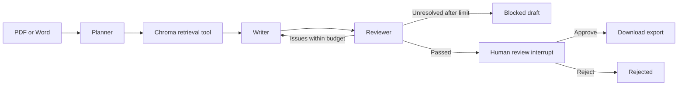

# Launch Studio — GTM Content Agent

Week 3 Project 3D: a Streamlit application that turns a PDF/Word product or event brief into a LinkedIn post, promotional email, short blog draft and three ad variations. A LangGraph planner chooses search queries, a vector retrieval tool supplies evidence, a writer drafts the content, and a reviewer requests bounded revisions before human approval unlocks export.

## Run in VS Code

Open this `gtm_agent` folder. From its terminal, using the existing parent environment:

```sh
../.venv/bin/python -m pip install -r requirements.txt
../.venv/bin/python -m streamlit run app.py --server.port 8502 --server.address 127.0.0.1
```

Or from the repository root:

```sh
.venv/bin/python -m streamlit run gtm_agent/app.py --server.port 8502 --server.address 127.0.0.1
```

For a standalone checkout, create a Python 3.11/3.12 virtual environment and install `requirements.txt`. The app reads `.env` in this folder first, then the existing parent `.env` as a fallback; existing process environment values take precedence. Copy `.env.example` only when needed and fill `MODEL_BASE_URL`, `MODEL_API_KEY`, `CHAT_MODEL` and `EMBEDDING_MODEL`. No key is displayed in the UI or stored in graph state. No extra external services or publishing accounts are required.

`GTM_CHAT_MODEL` optionally overrides `CHAT_MODEL` for this app only. The current campaign setting is `Qwen/Qwen3-235B-A22B-Instruct-2507`; the smaller 30B model produced contradictory reviews in our local checks. This is a limited validation result, not a general model benchmark. The parent projects retain their own model settings, and embeddings are unchanged.

`config.json` controls the revision limit (two rewrites), retrieval top-k (four per query), maximum document chunks (150), maximum retrieved passages (12) and chunk size (1,800 characters). The model endpoint must support compatible HTTPS chat/completions and embeddings APIs. Current code sends JSON-schema instructions in the prompt and validates responses locally, retrying malformed structured responses once.

## Try it

1. Leave **Use fictional demo brief** selected to market Atlas Notes. For your own product, turn it off and choose **Upload document** or **Paste product details**. Changing only the campaign goal does not change the source product.
2. Set the campaign goal, audience and tone; click **Generate campaign**.
3. Watch planning, retrieval, drafting and review steps. Inspect the four output tabs, source passages and reviewer findings.
4. If the reviewer passes the draft, review the sources yourself and check the confirmation box before approving. Rejection blocks exports.
5. Download approved Markdown or JSON. Nothing is posted or emailed automatically.

The included Atlas Notes brief is fictional, with a fixed launch date, price, approved positioning and explicit unsupported-claim restrictions. Its dates and price are sample content, not real product information.

## Architecture



The planner supplies one to three queries; the retrieval node embeds document chunks and queries and searches an ephemeral Chroma collection. It merges query results with source locations. For briefs of twelve chunks or fewer, it retains every chunk to avoid dropping pricing, dates or constraints; then it deletes the collection. The writer receives only retrieved evidence for factual claims plus the user's creative direction. Inline citation IDs are checked against available sources, and the reviewer checks factual support, consistency and tone. A reviewer pass with invalid citation IDs is overridden.

This is a stateful pipeline with a review loop, not a single model call or a group of concurrently running agents. Planner, writer and reviewer are separate roles using the configured model. Retrieval is an application tool executed by LangGraph from planner-produced queries, rather than native API function calling. Raw model chain-of-thought is neither requested nor displayed; the trace records a short plan and operational events.

## State, privacy and limitations

LangGraph uses an in-memory checkpointer scoped to each Streamlit session. A browser/server restart may lose the draft and pending approval; persistent cross-session resume is not implemented. Starting a new generation clears any previous approval. Changing sidebar fields alone does not modify the current campaign; its original brief appears in the trace.

Uploads are parsed from a temporary file that is deleted after ingestion. Document chunks, draft content and graph state stay in server memory for the session. Extracted passages and campaign instructions are sent to the configured model provider on generation. The vector collection is ephemeral and deleted after retrieval. Clear the session when finished; this is not a multi-user production data-retention guarantee. Default local smoke-test outputs and private input folders are ignored by Git.

PDF extraction uses [pdfplumber](https://github.com/jsvine/pdfplumber); Word extraction uses [python-docx](https://python-docx.readthedocs.io/en/latest/api/document.html). Margin removal and tables are best effort. Scanned PDFs require OCR; Word pagination is represented by body blocks. Sources must be reviewed for extraction omissions.

A valid citation and a model review do not prove a claim is true. Retrieval can omit important constraints; model roles share potential blind spots. Unresolved reviews block export, but human approval remains essential. There is no web research: absent prices, dates and claims must be omitted or marked for confirmation. Generation latency and model costs depend on the number of revisions and retries.

Reviewer findings now identify the channel, defect category, an exact draft quotation and the sources checked. The application validates quotations and source IDs, requesting one correction if the review cites text that is not in the draft. A second invalid review stops with the draft retained and approval blocked. This verifies that findings refer to the actual draft; it does not prove the reviewer's interpretation is correct. Citation checks independently block invalid campaign references.

## Files and validation

- `app.py`: upload, progress, campaign tabs, sources and approval UI.
- `workflow.py`: LangGraph state, planning/review loop and export guard.
- `model.py`, `schemas.py`: provider adapter and validated response structures.
- `retrieval.py`: embedding and ephemeral Chroma retrieval.
- `document_loader.py`: self-contained copy of the document-agent ingestion implementation.
- `examples/atlas_launch.docx`: fictional sample brief.
- `examples/approved_campaign.md` and `.json`: user-approved sample suite and source/approval records.
- `examples/sample_campaign_draft.md` and `.json`: preserved pre-approval review snapshots.
- `VALIDATION.md`: automated checks, live sample results and known limitations.

```sh
# From this folder:
../.venv/bin/python -m pytest -q tests
# From repository root, including the school app:
.venv/bin/python -m pytest -q tests gtm_agent/tests
```

The published school and GTM projects contain 70 tests; fifteen specifically cover GTM revision control, human approval, rejected/invalid drafts, tool failure, vector-store isolation and the UI. The development workspace's 82-test run additionally included twelve tests from a separate, unpublished document-agent prototype. Model outputs are mocked in automated tests, while retrieval uses real Chroma. Live validation is documented separately; no independent accuracy or marketing-performance claim is made.

Earlier live runs exposed overly strict reviewer judgments, including demands for an absent URL. Structured findings, calibrated instructions and the campaign model override improved the tested examples. See [validation notes](VALIDATION.md); passing automated tests does not establish content-review accuracy. A model-passed draft still requires human approval before export.

## Empty campaign troubleshooting

The sidebar identifies the source product. For fitness content, turn off the Atlas Notes demo and supply the actual fitness product name, features and audience through upload or pasted details; a campaign goal alone is not a factual product brief. Unknown prices, dates, URLs and health/performance claims must not be invented.

If generation stops before creating drafts, the page now explicitly says no campaign was created and shows the failed stage. Provider errors distinguish rejected credentials, missing models/endpoints, quota limits and timeouts without displaying credentials or raw provider responses. Structured responses wrapped in JSON code fences are accepted; invalid or whitespace-only content still fails validation after one repair attempt. Existing draft tabs remain visible if a later review step fails.
